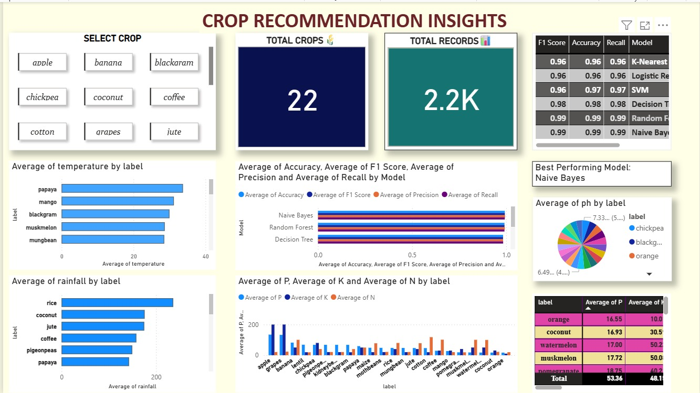
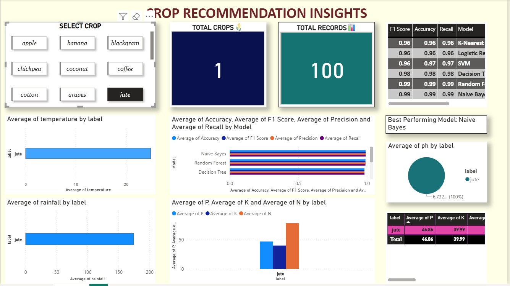
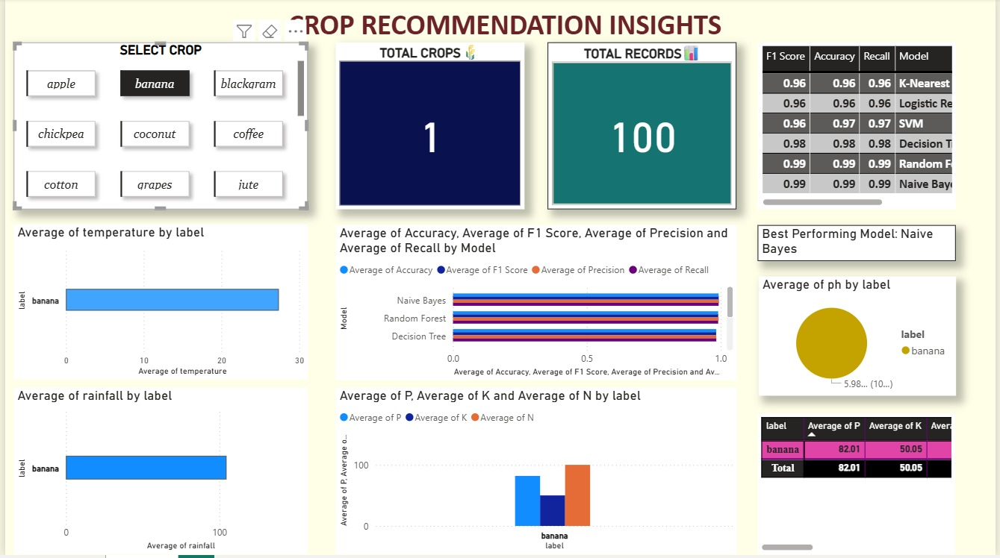

# Climate-Based Smart Crop Suggestion System

## Overview

A machine learning-based system that recommends the most suitable crop based on soil nutrients and climatic conditions. The project integrates real-time weather data and visual analytics to support data-driven agricultural decisions.

---

## Problem Statement

Farmers often rely on traditional knowledge for crop selection, which may not align with changing environmental conditions. This project addresses the need for a data-driven solution that improves crop selection, productivity, and adaptability to climate change.

---

## Key Features

* Machine learning model for crop recommendation
* Real-time weather integration using API
* Data preprocessing, feature scaling, and exploratory data analysis (EDA)
* Comparative analysis of multiple ML models
* Power BI dashboard for data visualization and insights
* User-driven prediction based on environmental inputs

---

## Technologies Used

* Python (Pandas, NumPy, Matplotlib, Seaborn, Scikit-learn)
* Google Colab
* Power BI
* OpenWeatherMap API

---

## Dataset

* Source: Kaggle Crop Recommendation Dataset
* Link: https://www.kaggle.com/datasets/atharvaingle/crop-recommendation-dataset

Note: Only a sample dataset is included due to size limitations. Use the link above to access the full dataset.

---

## Methodology

1. Data Collection and Preprocessing

   * Handled missing values and performed statistical analysis

2. Exploratory Data Analysis

   * Used visualizations to understand feature distributions and relationships

3. Feature Scaling

   * Applied normalization using StandardScaler

4. Model Training

   * Trained multiple models:

     * Logistic Regression
     * K-Nearest Neighbors
     * Decision Tree
     * Random Forest
     * Support Vector Machine
     * Naive Bayes

5. Model Evaluation

   * Evaluated using Accuracy, Precision, Recall, and F1 Score
   * Best model: **Naive Bayes (F1 Score: 99.29%)**

6. Prediction System

   * Built a function to predict crops based on user input

7. Real-Time Integration

   * Used API to fetch weather data and generate dynamic predictions
   * Note: API keys are not included in this repository for security reasons.
To run the project, generate your own API key from OpenWeatherMap and add it in the code.

---

## Results

* Achieved high predictive performance using Naive Bayes
* Successfully integrated real-time weather data
* Demonstrated strong correlation between soil nutrients and crop suitability

---

## Dashboard Preview

### Dashboard 1



### Dashboard 2



### Dashboard 3



---

## How to Run

### Notebook

Open the `.ipynb` file using:

* Google Colab
* Jupyter Notebook

### Install Dependencies

```bash
pip install pandas numpy matplotlib seaborn scikit-learn
```

---

## Project Structure

```
CropRecommendationProject/
├── notebook/
├── data/
├── dashboard/
└── README.md
```

---

## Future Improvements

* Mobile application for farmers
* Fertilizer and irrigation recommendations
* Advanced analytics and visualization
* Integration with additional real-time data sources

---

## Security Note

API keys are not included in this repository for security reasons.

---

## Author

Mishthi Rastogi
